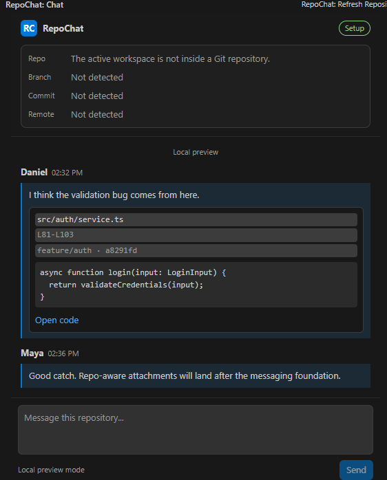

# RepoChat

[](https://github.com/Yisuskr/repochat/actions/workflows/ci.yml)
[](LICENSE)
[](https://code.visualstudio.com/)
[](CHANGELOG.md)

RepoChat is a VS Code-native collaboration extension for developers working inside the same Git repository. It brings repository-aware conversation, source references, and editor-native code sharing into one compact sidebar.



## Why It Exists

Developer chat often loses the code context that sparked the conversation. RepoChat is built around the repository itself: select code, share it into a chat message, and reopen the exact referenced lines from the attachment.

This repository is designed to be readable by engineering teams: small services, strict TypeScript, security-aware defaults, CI, packaging, and clear product milestones.

## Current Capabilities

- Adds a RepoChat Activity Bar container and sidebar chat view.
- Detects the active workspace repository using local Git metadata.
- Displays remote URL, normalized owner/repository identifier, branch, and commit SHA.
- Sends local in-memory messages from the sidebar composer.
- Shares selected editor code into RepoChat as a source attachment.
- Captures relative file path, line range, selected text, branch, commit, and repository slug.
- Opens source attachments back in VS Code and reveals the referenced lines.
- Includes strict TypeScript, ESLint, Prettier, CI, secret checks, `.vsix` packaging, and service tests.

## Install Locally

RepoChat is not published to the VS Code Marketplace yet. To try the current preview build:

1. Download or build `dist/repochat-0.0.1.vsix`.
2. In VS Code, open the Command Palette.
3. Run **Extensions: Install from VSIX...**.
4. Select the `.vsix` file.
5. Open a Git repository folder and click the RepoChat Activity Bar icon.

Build the `.vsix` yourself:

```powershell
pnpm install
pnpm run package:vsix
```

## Try The Source Sharing Flow

1. Open a file in VS Code.
2. Select a few lines of code.
3. Right-click and choose **Share in RepoChat**.
4. Open the RepoChat sidebar.
5. Click **Open code** on the attachment to jump back to the referenced lines.

## Current Limitations

- Messages are local and in-memory only.
- Supabase schema is versioned, but the extension is not connected to Supabase yet.
- GitHub authentication and private repository access verification are not implemented yet.
- Presence and realtime messaging are planned but not active.
- The preview screenshot shows the current local-only experience.

## Architecture

- `src/extension.ts` registers VS Code commands and the RepoChat sidebar.
- `src/services/gitService.ts` detects repository metadata through local Git.
- `src/services/localMessageService.ts` stores local preview messages and code attachments.
- `src/webview/RepoChatViewProvider.ts` coordinates webview messages with extension-host behavior.
- `src/webview/webviewHtml.ts` renders the compact editor-native UI.
- `supabase/migrations/` contains the planned Postgres/RLS schema for persistent collaboration.

## Development

Install dependencies:

```powershell
pnpm install
```

Run checks:

```powershell
pnpm run check
```

Run only the tracked-file secret check:

```powershell
pnpm run secrets:check
```

Package a local `.vsix`:

```powershell
pnpm run package:vsix
```

Open the folder in VS Code and press `F5` to launch an Extension Development Host. The RepoChat icon appears in the Activity Bar.

## Roadmap

- Add a short demo GIF for the source sharing flow.
- Add Supabase client configuration without committed secrets.
- Add GitHub authentication with minimal scopes.
- Verify private repository access server-side.
- Add persistent realtime messages and presence.
- Resolve source references after files move or code changes.
- Publish a polished preview build to the VS Code Marketplace.

## Security

No secrets are required for the current local preview. Future Supabase configuration should use workspace/user settings or ignored `.env` files, never committed keys. See [SECURITY.md](SECURITY.md) for reporting guidance.
